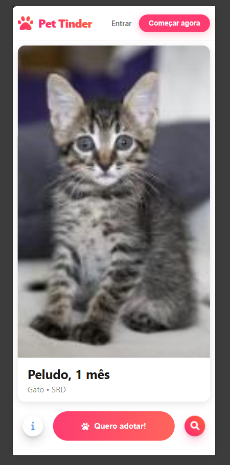
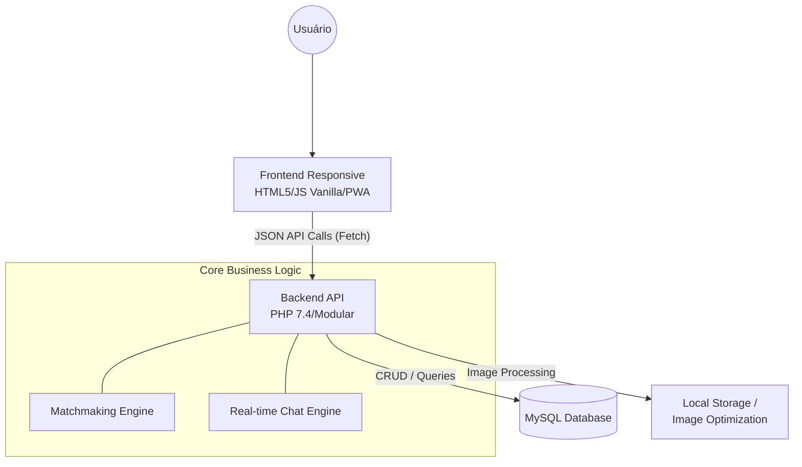
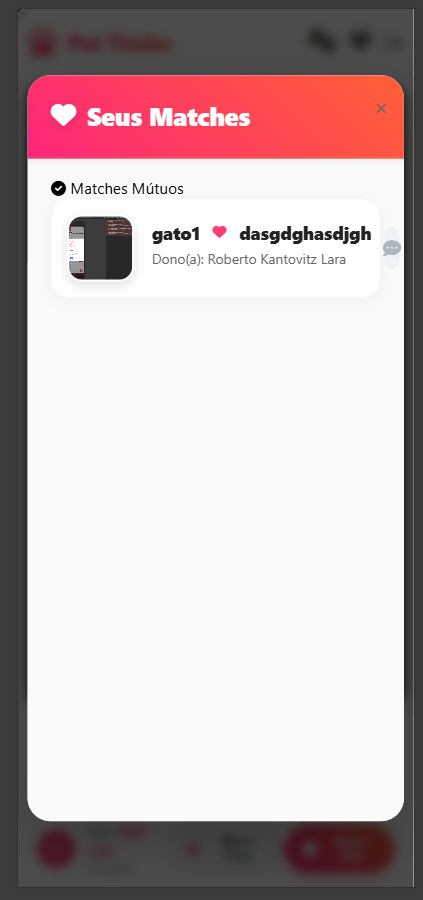
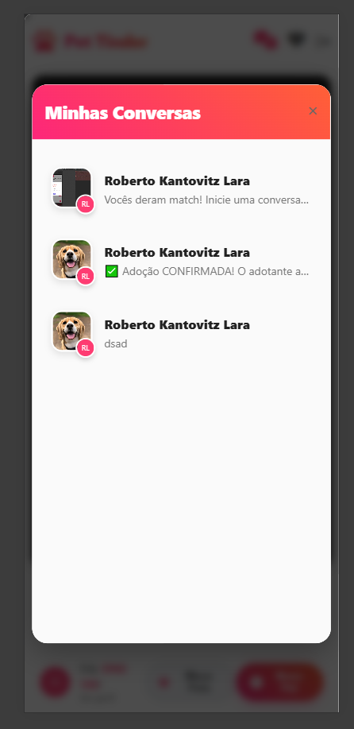
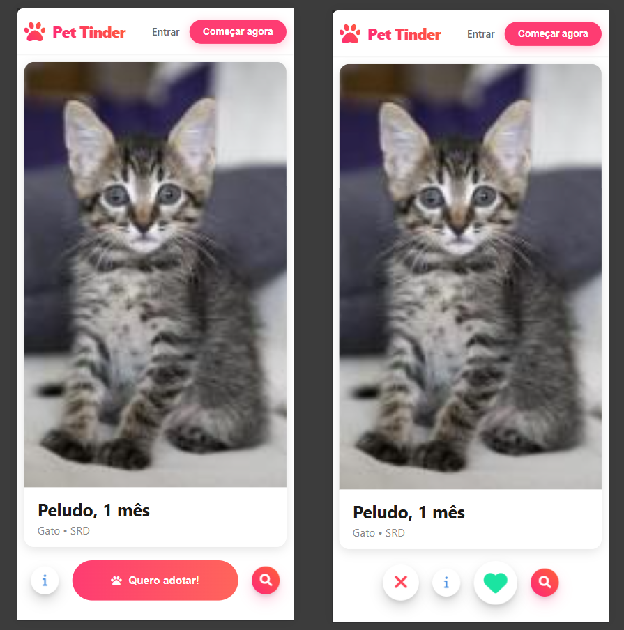
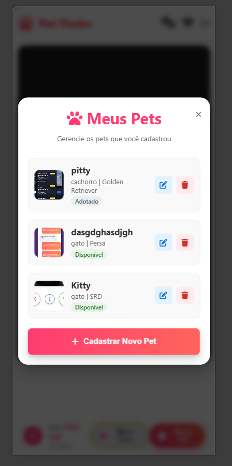
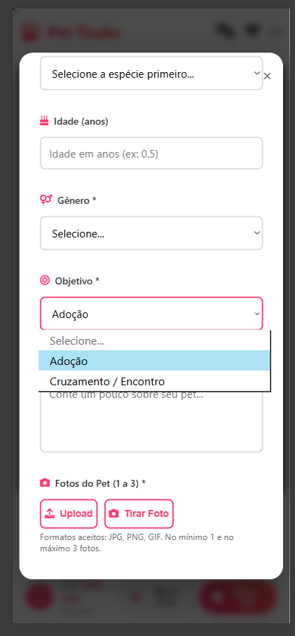

# 🐾 Pet Tinder: Plataforma de Matchmaking e Adoção Animal

> Um Web App interativo inspirado em dinâmicas de "Swipe", projetado para conectar pets e tutores com foco em adoção responsável e cruzamento.



## 📄 Sobre o Projeto

O Pet Tinder é uma plataforma completa que gamifica e facilita o processo de encontrar o par ideal para um animal, seja para adoção por ONGs/Pessoas Físicas, ou para cruzamento. 

O sistema possui um motor de interações complexo que gerencia *Likes*, *Dislikes* e *Matches* mútuos, abrindo canais de comunicação em tempo real entre os usuários apenas quando há interesse recíproco ou intenção direta de adoção.

### 🎯 Principais Funcionalidades e Desafios Técnicos

*   **🔄 Engine de Matchmaking (Swipe):**
    *   Algoritmo que impede a exibição de pets do próprio usuário ou perfis que já receberam interação anterior.
    *   Gestão de estado assíncrono para transições fluidas de cards no frontend.
*   **💬 Chat e Notificações em Tempo Real:**
    *   Sistema de mensageria construído com *Long Polling* em JavaScript Vanilla, garantindo atualizações de leitura (`is_read`) e notificações sem recarregar a página.
*   **📑 Fluxo de Adoção Seguro:**
    *   Módulo integrado ao chat onde o doador pode enviar um convite formal de adoção.
    *   Assinatura digital de **Termos de Responsabilidade** com validação de máscara de CPF diretamente na interface.
*   **📷 Processamento de Imagens Nativo:**
    *   Upload múltiplo de fotos com script backend em PHP que realiza redimensionamento dinâmico e compressão (alvo de 200kb a 500kb) on-the-fly, convertendo arquivos para JPEG para otimização de banda.
*   **📍 Geolocalização e APIs:**
    *   Integração com a API ViaCEP para preenchimento ágil de endereços.
    *   Fallback para captura de Latitude/Longitude via GPS do navegador (Geolocation API) ou via API Nominatim (OpenStreetMap).

---

## 🏗️ Arquitetura do Sistema

Abaixo, a representação de alto nível do fluxo de dados e componentes:



---

## 🛠️ Stack Tecnológica

*   **Backend:** PHP 7.4+ (Arquitetura modularizada com endpoints em formato JSON/REST-like).
*   **Banco de Dados:** MySQL (Consultas avançadas com `JOINs`, `UNIONs` e subqueries para validação de matches).
*   **Frontend:** HTML5, CSS3, JavaScript Vanilla (Fetch API).
*   **Segurança:** Proteção CSRF via tokens dinâmicos de sessão e hash de senhas (`password_hash`).
*   **PWA:** Implementação de Service Workers (`sw.js`) e Manifest para instalação nativa em dispositivos móveis.

---

## 🔌 Exemplos de API (Request/Response)

Abaixo estão os payloads típicos consumidos pelo Frontend:

### 1. Sistema de Match (Swipe Right)
**Endpoint:** `POST /api/match.php`
*   **Request Body:**
    ```json
    {
      "pet_id": 42,
      "target_pet_id": 15,
      "action": "like"
    }
    ```
*   **Response (Match Mútuo!):**
    ```json
    {
      "status": "success",
      "match": true,
      "chat_id": "99f8e2",
      "message": "It's a Match! Chat liberado."
    }
    ```

### 2. Busca Georeferenciada
**Endpoint:** `GET /api/pets.php?distancia=10&lat=-23.55&lng=-46.63`
*   **Response:**
    ```json
    [
      {
        "id": 15,
        "name": "Rex",
        "distance_km": 2.4,
        "images": ["url_thumb_1.jpg"]
      }
    ]
    ```

---

## 📸 Galeria do Sistema

Abaixo, os principais fluxos de navegação e telas da plataforma:

| Interação e Descoberta | Seus Matches |
|:---:|:---:|
|  |  |
| *Interface de swipe com filtros avançados de busca.* | *Painel de conexões mútuas e interesses recebidos.* |

| Comunicação (Real-time) | Fluxo de Adoção |
|:---:|:---:|
|  |  |
| *Mensageria integrada para negociação.* | *Aceite formal de responsabilidade do adotante.* |

| Gestão de Perfil | Cadastro Clínico |
|:---:|:---:|
|  |  |
| *Controle de status (Disponível/Adotado).* | *Upload otimizado de imagens e captura via câmera.* |

---

## 🧪 Testes e Qualidade

O projeto conta com uma cobertura básica de testes unitários para a engine de matchmaking, garantindo que as regras de reciprocidade e filtros de visualização funcionem corretamente.

---

## ⚙️ CI/CD

Utilizamos **GitHub Actions** para automação de processos em cada Pull Request:
*   **Linting:** Verificação de padrões de código (PSR-12).
*   **Testes:** Execução automática da suíte de testes unitários.
*   **Build:** Validação do build do ambiente Docker.

---

**Nota Técnica:** Este é um repositório de portfólio. O código-fonte integral não está publicado por conter regras de negócios proprietárias e integrações de segurança específicas.
